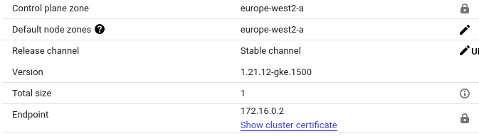
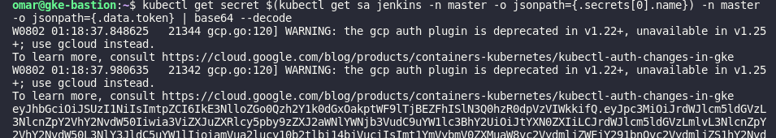

# Jenkins On GKE Cluster

installing `kubernetes-plugin` for Jenkins

# Setting up the Jenkins Agent

- Go to Manage Jenkins | System Configuration | Manage Nodes and Clouds | On the left menu Configure Clouds
  | Kubernetes (Add kubenretes cloud)
- Fill out plugin values
  - Name: my-gke-cluster # your cluster name
  - Kubernetes URL: https://172.16.0.2 # your cluster api url <br />
  - Kubernetes Certificate key:to get it go to your gke cluster <br />
    click on `show cluster certificate`<br />
    
  - Kubernetes Namespace: master
  - now for the next step you need to get the token of the jenkins pod's SA <br />
    by runnig `kubectl get secret $(kubectl get sa jenkins -n master -o jsonpath={.secrets[0].name}) -n master -o jsonpath={.data.token} | base64 --decode`
    
  - Credentials | Add | Jenkins (Choose secret text |add token | Save)
  - Test Connection | Should be successful! If not, check RBAC permissions and fix it!
  - Jenkins URL: http://`External-ip:8080`
  - Tunnel : `internal-ip svc`:50000
- Save

# running docker in the jenkins agent

To run docker commands inside a jenkins agent you will need a custom jenkins agent with docker working.

- Add a Jenkins Pipeline

```
pipeline {
    agent {
        kubernetes {
          cloud "my-gke-cluster"
          yaml '''
apiVersion: v1
kind: Pod
metadata:
  name: docker-pod
spec:
  containers:
  - name: kubectl
    image: joshendriks/alpine-k8s
    command: ['cat']
    tty: true
  - name: docker
    image: docker:latest
    command:
    - cat
    tty: true
    volumeMounts:
     - mountPath: /var/run/docker.sock
       name: docker-sock
  volumes:
  - name: docker-sock
    hostPath:
      path: /var/run/docker.sock
        '''
        }
    }
}
```


# Setting up the pipeline

- First we need to create kubeconfig file and pass it to the <br />
  jenkins agent inorder deploy the application [Setup](https://ahmet.im/blog/authenticating-to-gke-without-gcloud/)<br/>
  ```
  GET_CMD="gcloud container clusters describe my-gke-cluster --zone=europe-west2-a"
  cat > kubeconfig.yaml <<EOF
  apiVersion: v1
  kind: Config
  current-context: my-cluster
  contexts: [{name: my-cluster, context: {cluster: cluster-1, user: user-1}}]
  users: [{name: user-1, user: {auth-provider: {name: gcp}}}]
  clusters:
  - name: cluster-1
    cluster:
        server: "https://$(eval "$GET_CMD --format='value(endpoint)'")"
        certificate-authority-data: "$(eval "$GET_CMD --format='value(masterAuth.clusterCaCertificate)'")"
  EOF
  ```
- Second get a `key.json` of a service account that have the right premissions <br />
  to the GKE cluster


-  Now, you can go to an environment without gcloud, take this kubeconfig file <br />
   and combine it with your Service Account key file and authenticate to your <br /> 
   GKE clusters from headless environments by setting these environment variables:<br />

```
export GOOGLE_APPLICATION_CREDENTIALS=service-account-key.json
export KUBECONFIG=kubeconfig.yaml
```

- to test it run shell command inside the pipeline in `kubctl container`
```
withCredentials([
    file(credentialsId: credsId1, variable: 'KUBECONFIG'),
    file(credentialsId: credsId2, variable: 'GOOGLE_APPLICATION_CREDENTIALS')
]){
    // run kubectl commands !!!
      `sh 'kubectl get nodes' // You are authenticated if this works! 
}
```

# Running up the pipeline

- I created a simple node application [GitHub Repo](https://github.com/OmarSolimanDev/Simple-Nodejs-App.git)

- You can also find a `Dockerfile` to build image from the app

- Also Deployment and service files will be used to deploy the created image

- on your bastion host run `kubectl get svc -n dev`

- Copy the  `External-ip:80` address to your browser.<br />
<!--  -->